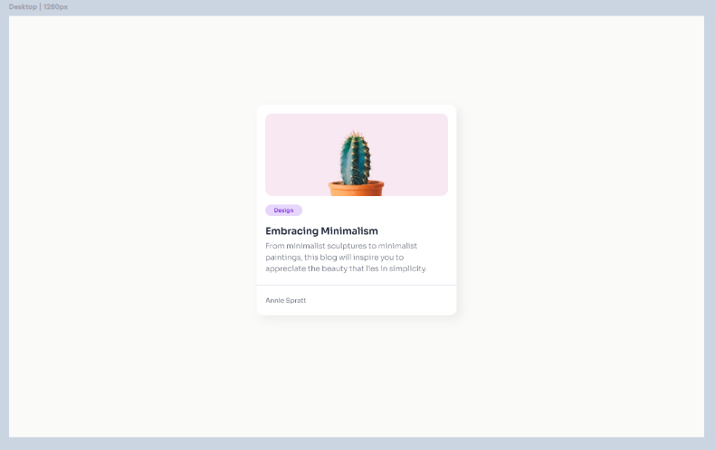
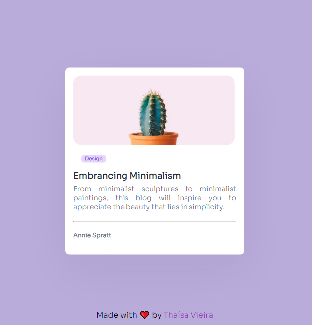
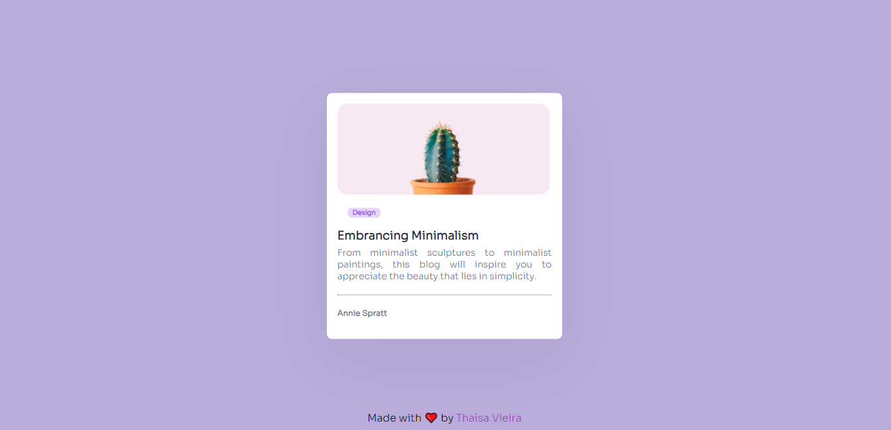

# Responsive Mini Blog Card by devChallenges

## Overview

This challenge, made by devChallenges and is part of the Responsive Web Design path, aims to exercise basic HTML and CSS skills by creating a simple blog card that includes an image, a title, a short description, and a tag. The [devChallenges website](https://devchallenges.io/) provides an idea of ​​what to expect from the result of the challenge, as well as material such as images and icons. In addition to base measurements, colors, sizes and fonts are also provided.The orignal challenge can be checked by this [link](https://devchallenges.io/challenge/27).

## What expect

In this project, semantic HTML was implemented, card creation and centralization, text and image stylization as well, with the aim of ensuring that the project had a design as close as possible to the challenge proposal.
The proposed design of the project can be seen below:

## What I have made

- Mobile (640px):

- Desktop (1280px):

## Difficulties, learnings and comments

Soon..
